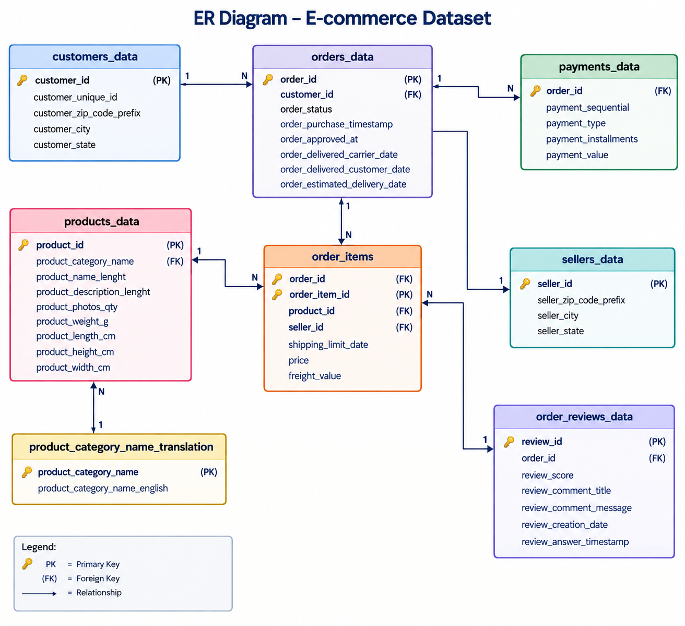

# Olist E-Commerce Seller Growth Analytics Pipeline
 
## What is this Project?
 
An end-to-end Azure data engineering pipeline that ingests [Olist's](https://olist.com/) public e-commerce dataset (1M+ records) and serves clean, query-ready data to analysts and business stakeholders through Power BI — so seller growth can be tracked without anyone touching raw files or writing Spark code.
 
## What Problem Does It Solve?
 
Olist releases raw e-commerce data (orders, payments, reviews, products, sellers) as a set of disconnected CSV files. In that raw form, business teams can't use it directly — it's unvalidated, unstructured for analysis, and requires manual joins across multiple files just to answer a simple question like "how is a seller's order volume trending?"
 
This pipeline solves that by automating the full journey from raw data to business-ready insight:
- **Ingests** the raw dataset reliably on a schedule instead of manual downloads
- **Validates and cleans** the data so analysts aren't working with duplicates, nulls, or broken relationships
- **Exposes** it through a queryable SQL layer instead of scattered CSVs
- **Delivers** it into Power BI dashboards non-technical stakeholders can use directly

 


 

## Tech Stack
 
| Layer | Tool |
|---|---|
| Ingestion / Orchestration | Azure Data Factory |
| Storage | Azure Data Lake Storage Gen2 (Bronze, Silver) |
| Transformation | Azure Databricks (PySpark) |
| Serving Layer | Azure Synapse Analytics — Serverless SQL Pool |
| Visualization | Power BI |
 
## Architecture Flow
 
| Step | Stage | Description |
|---|---|---|
| 1 | **Ingest** | Azure Data Factory fetches raw data from Olist's public dataset repository via Copy Activity |
| 2 | **Bronze** | Raw, unprocessed data lands in the Bronze container of ADLS Gen2 |
| 3 | **Transform** | Azure Databricks reads from Bronze, runs data quality checks, cleans and transforms the data, and writes it to the Silver container |
| 4 | **Serve** | Azure Synapse Serverless SQL Pool creates external tables/views directly on Silver data — query-in-place, no data duplication |
| 5 | **Visualize** | Power BI connects to the Synapse Serverless SQL endpoint to build seller growth dashboards |
 
**Pattern:** Bronze → Silver → Synapse (Serverless SQL) → Power BI
 
> Serverless SQL Pool was chosen over a Dedicated Pool to avoid duplicating storage and compute cost — Synapse queries the Silver files directly instead of loading them into managed tables.
 
## Data Model (ER Diagram)
 
The Olist dataset is relational — orders sit at the center, linking customers, order items, payments, and reviews, while order items connect to products and sellers.
 

 
 
## Repository Structure
 
```
olist-ecommerce-data-pipeline/
├── README.md
├── ARCHITECTURE_DIAGRAM.png
├── ER_DIAGRAM.png
├── AZURE_DATA_FACTORY/
│   └── e-commerce-project-pipeline.json
├── DATABRICKS/
│   └── ECOMMERCE_SILVER_LAYER_NOTEBOOK.py
├── SYNAPSE/
│   └── CREATE EXTERNAL TABLES.sql
    └── CREATE VIEW FOR EACH TABLE.sql
    └── SET UP EXTERNAL DATA SOURCE.sql
```
 
## Data Source
 
[Olist Store E-Commerce Public Dataset](https://www.kaggle.com/datasets/olistbr/brazilian-ecommerce) — ~1M+ order, customer, and seller records released publicly for analytics use.
 
## Key Highlights
 
- Fully automated ingestion via Azure Data Factory Copy Activity
- Data quality checks and cleansing performed in Databricks before promotion to Silver
- Query-in-place serving layer (Serverless SQL) — no redundant data copies, lower cost
- Power BI dashboards built directly on top of Synapse views for seller growth analysis
## Author
 
**Prashant More**
Data Engineer / Data Analyst  | [LinkedIn](#) · [GitHub](#)
